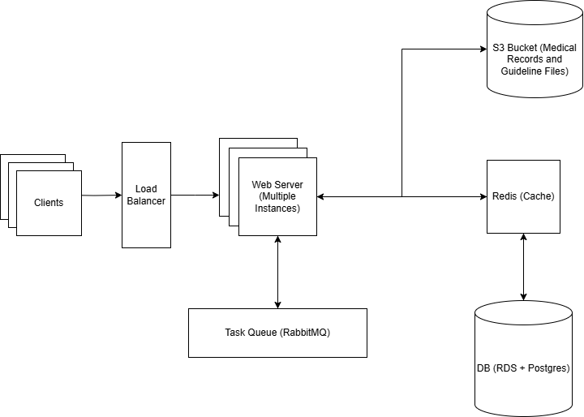

## Overview

The structure of this README is as follows:

- [Overview](#overview)
- [Setup - Backend](#setup---backend)
- [Setup - Frontend](#setup---frontend)
- [Task 1](#task-1)
- [Task 2](#task-2)

Answers to any open ended questions will be in the corresponding numbered task section.

## Setup - Backend

Create a virtual environment:

```bash
python3 -m venv .venv
```

Activate the virtual environment:

```bash
source .venv/bin/activate
```

Run the following command to install the dependencies:

```bash
pip install -r requirements.txt
```

Run the following command to start the backend server:

```bash
uvicorn backend.main:app --reload
```

Run the following command to run the tests:

```bash
pytest
```

## Setup - Frontend

Navigate to the frontend directory and run the following command to install the dependencies:

```bash
npm install
```

Run the following command to start the frontend server in development mode:

```bash
npm run dev
```

Navigate to `http://localhost:3000` to view the application.

Run the following command to start the frontend server in production mode:

```bash
npm run build
npm run start
```

Navigate to `http://localhost:3000` to view the application.

Run the following to lint the frontend code:

```bash
npm run lint
```

## Task 1

The current design considerations for buttons and loading states are as follows:

- **Consistent Color Scheme:**

  - Ensure that the loading states for both buttons use the same color scheme to avoid confusion on the same page.

- **Guided Process:**
  - Separate the uploads into distinct steps/pages. This approach reduces state checks and clarifies the process.
  - Automatically redirect users to the next step after uploading the medical record to streamline the workflow.
  - We would have to allow the user to go back to the previous step, so they can change their medical record if they need to.

## Task 2

The overall backend architecture is as follows:

- FastAPI is used to create the API endpoints
- SQLAlchemy for the ORM
  - I chose this as its a easy and lightweight ORM
- The database is a SQLite database that is stored in a file called `test.db`
  - I wanted to use a SQLite database as opposed to doing an in-memory simulated DB (python dictionaries) just to make it slightly more realistic

To scale this application for production I would consider the following improvements:

- **Database Upgrade:**

  - This is a mostly a given since SQLite is much more suited to a prototyping environment. I would likely transition to something like Postgres or MySQL
  - I would also consider adding an S3 bucket for storing the medical records and guidelines files.

- **Task Queue Implementation:**

  - Use a task queue like RabbitMQ to manage background tasks. This would be if I were to handle the processing of the medical records and guidelines that we were simulating in the backend.

- **Load Balancing:**

  - Implement a load balancer (e.g., AWS Elastic Load Balancing, NGINX). This is pretty standard practice, but this would depend on how much traffic the application would receive.

- **Caching Strategy:**

  - Add caching with something like Redis. I am sure this is a necessity, given the use case where I am sure UM nurses would be jumping back and forth between different instances of records and guidelines.

- **Monitoring and Logging:**

  - Set up something like Prometheus for monitoring and logging. It would be a good idea as the LLM pipeline has a lot of moving parts I assume.

- **Horizontal Scaling:**

  - Prepare for horizontal scaling with Docker for containerization and Kubernetes for orchestration.

- **Data Backup and Recovery:**

  - Add a robust backup and recovery strategy to protect against data loss. Medical records and data are important, and losing them would be costly.

Below is a high-level architecture diagram of the application:


